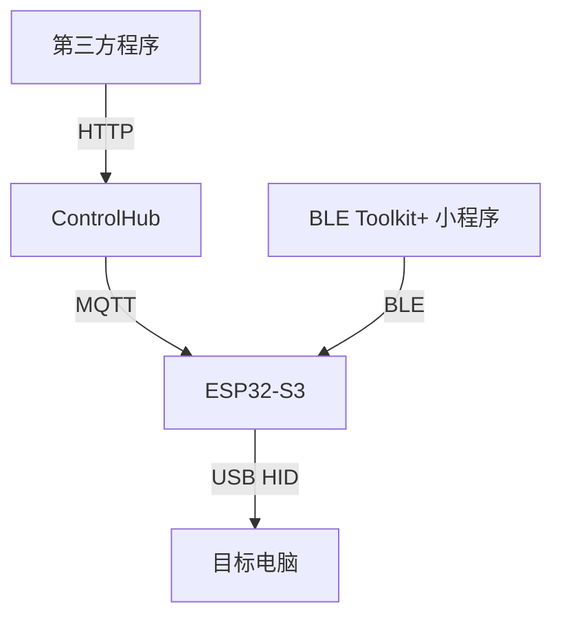

# Smart HID 系统架构与仓库拆分设计 v1.1

## 1. 总体结构



## 2. 仓库边界

全部开源（Apache-2.0）：

```text
smart-hid-workspace（本仓库：controlhub / firmware / web / protocols / docs）
smart-ble（独立仓库：BLE Toolkit+ 小程序 + 协议公开定义事实源）
```

## 3. 本地工作区建议

```text
Smart-HID-Workspace/
├── smart-ble/
├── smart-hid-controlhub/
└── smart-hid-firmware/
└── smart-hid-web/
```

## 4. 事实源

### BLE Provisioning
`smart-ble/core/protocols/hid-provisioning-protocol.*`

### MQTT Command
`smart-ble/core/protocols/hid-command-schema.*`

### ControlHub HTTP
`smart-hid-controlhub/docs/openapi.yaml`

## 5. 运行依赖

没有：
- Firmware → 云端实时依赖
- Command → 云端实时依赖
- 小程序 → 云端依赖

整个系统没有云端，控制链路完全本地。

## 6. 开发顺序

1. 协议
2. ControlHub + Firmware 本地闭环
3. BLE 配网
4. 生产安全
