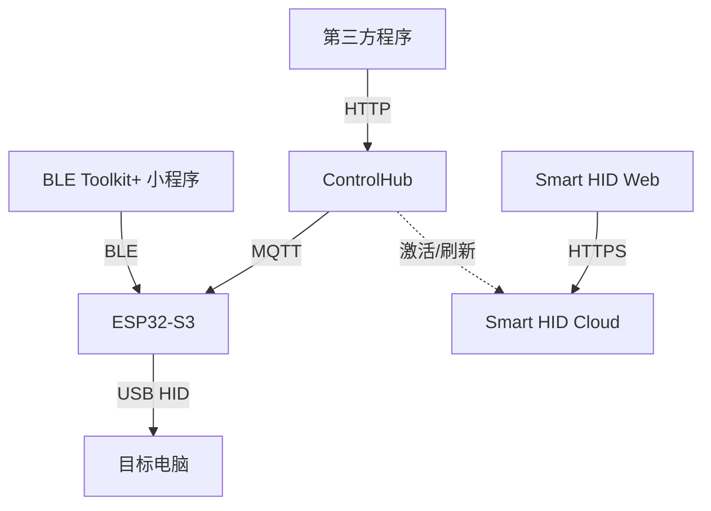

> ⚠️ **历史资料（SUPERSEDED）**：本文件属 2026-08-11 设计资料包快照，其中 Cloud / Trial / License / 商业化等设计已于 2026-08 从产品移除。本文仅作设计推演的历史记录保留，**不得作为当前实现依据**；当前事实见 `docs/current/CURRENT_STATE.md`。

# Smart HID 系统架构与仓库拆分设计 v1.1

## 1. 总体结构



## 2. 仓库边界

### Public

```text
smart-ble
```

包含：
- BLE Toolkit+
- Smart HID 配网页面
- BLE/Smart HID 协议公开定义
- Demo
- Docs

### Private

```text
smart-hid-controlhub
smart-hid-firmware
smart-hid-cloud
smart-hid-web
```

## 3. 本地工作区建议

```text
Smart-HID-Workspace/
├── smart-ble/
├── smart-hid-controlhub/
├── smart-hid-firmware/
├── smart-hid-cloud/
└── smart-hid-web/
```

## 4. 事实源

### BLE Provisioning
`smart-ble/core/protocols/hid-provisioning-protocol.*`

### MQTT Command
`smart-ble/core/protocols/hid-command-schema.*`

### ControlHub HTTP
`smart-hid-controlhub/docs/openapi.yaml`

### License
`smart-hid-cloud/docs/license-format.md`

## 5. 运行依赖

没有：
- Firmware → Cloud 实时依赖
- Command → Cloud 实时依赖
- 小程序 → License Cloud 依赖

## 6. 开发顺序

1. 协议
2. ControlHub + Firmware 本地闭环
3. BLE 配网
4. Trial
5. Web / Cloud / License
6. Production Security
